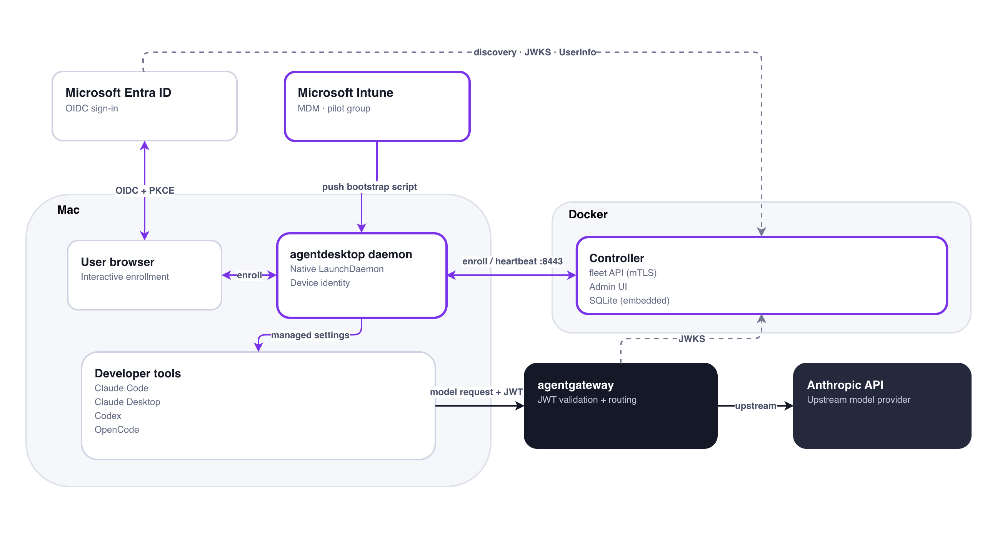

# Agentdesktop Field Kit

[](https://github.com/day0ops/agentdesktop-field-kit/actions/workflows/ci.yml)
[](LICENSE)

A guided wizard to stand up an [agentdesktop](https://agentdesktop.dev) demo on macOS: local Docker-based controller, real Microsoft Entra ID for sign-in, Microsoft Intune managing the pilot Mac.

## Architecture



## Prerequisites

- macOS (arm64 or amd64)
- [Docker Desktop](https://www.docker.com/products/docker-desktop/), with host networking enabled: Settings > Resources > Network > Enable host networking (required - the controller and agentgateway both bind to `127.0.0.1` inside their containers, which normal `-p` port publishing can't reach)
- [Homebrew](https://brew.sh), then: `brew install azure-cli jq gum`
- `openssl` 3.x
- Microsoft Entra ID + Intune tenant
- `ANTHROPIC_API_KEY` - Note: the wizard prompts for it and it's never written to disk

## Quick start

```
./run-demo.sh
```

### Advance Installation

Guided, resumable wizard. It remembers which steps are already done (in `state/wizard-progress`) and asks before re-running a completed step or doing anything destructive.

- `./run-demo.sh --from STEP_ID` - jump straight to a step, treating everything before it as already done. Useful for resuming after a break instead of clicking through steps you've already finished. Step ids are the short names the wizard prints as section headers, e.g. `preflight`, `pilot-user`, `entra-app`, `entra-consent`, `intune-licensing`, `controller-up`, `agentgateway-up`, `daemon-prepare`, `daemon-enroll`, `intune-groups`, `intune-push`, `intune-enroll`, `validate`.
- `./run-demo.sh --reset` - clear all recorded progress and start over from the first step.

Or run any `scripts/NN-*.sh` standalone - all support `--dry-run` and `--help`.

## What gets created

- **Entra ID**: pilot user, "agentdesktop enrollment" app registration (no secret, PKCE, loopback redirect), admin consent, pilot security group.
- **A second app registration** ("agentdesktop field-kit automation") purely to work around Azure CLI being unable to hold the Intune Graph permission it needs (`AADSTS65002` - Microsoft blocks first-party apps from ad hoc scope grants). Holds a secret only for the seconds it takes to mint a token; deleted immediately after, every run. See `lib/get-graph-app-token.sh`.
- **Local controller**: `docker run` of the published image (SQLite, no Kubernetes/Postgres).
- **Intune**: a shell script (not a signed/notarized PKG - we don't have a notarization identity for a same-day pilot) that installs the daemon as a LaunchDaemon and writes its bootstrap config.

## Teardown

```
./scripts/90-teardown.sh                                     # local only
./scripts/90-teardown.sh --include-cloud                     # + Entra/Intune objects
./scripts/90-teardown.sh --include-cloud --wipe-state --yes  # full reset
```